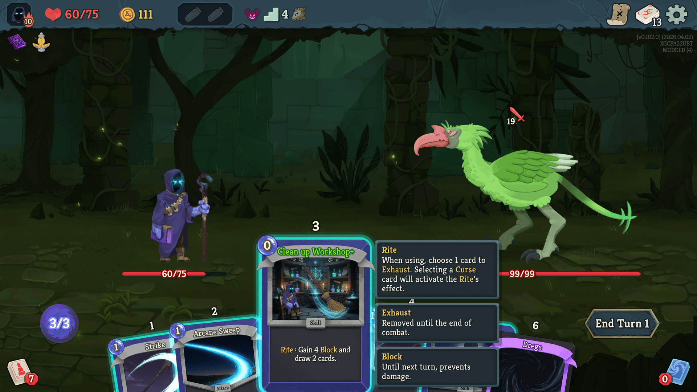

# Slay the Spire 2 Mod - The Cursed

Adds a new character "The Cursed" to Slay the Spire 2 game.

## Introduction
A wanderer corrupted by darkness. Uses curse, magic circle, and sometimes forbidden weapons that bring karma.

## Character Mechanism
### Rite
When using a Rite card, choose 1 card to Exhaust. Selecting a Curse card will trigger the Rite's effect.
### Circle
An unplayable card that can be triggered by using other cards while in hand.
### Karma
Some cards with forbidden power bring you Karma as a penalty. Karma deals self-damage the character at the end of the next turn.

## Known Issues
- Animation is not supported yet...

## Credit (Human)
Special thanks to 히말군 for character artwork (from the STS1 mod of The Cursed)

## Credit (AI)
Grok Imagine (card images)

Claude Code (code contributions)